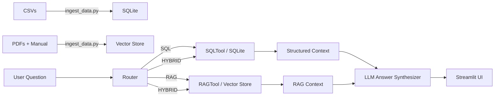

# Toyota / Lexus Agentic Assistant

Mini agent that answers questions using:

- **Structured data** (CSVs → SQLite via LLM-generated SQL)  
- **Unstructured documents** (contracts + warranty PDFs) via a small **RAG** index  
- **Owner’s manuals**: several models are fetched automatically when possible; if Toyota blocks some downloads (403), they are added manually as fallback, as allowed in the assignment.

The agent decides between **SQL**, **RAG**, or **HYBRID**, executes the tools, and returns:

- Final answer  
- SQL used (when applicable)  
- RAG sources (citations)

---

## 1. High-Level Architecture

**Main components**

- `ingest_data.py`
  - Loads CSVs into **SQLite** (`sales_data.db`)
  - Extracts text from provided PDFs (contracts + warranty)
  - Attempts to automatically download multiple Toyota owner’s manuals  
    - Some PDFs succeed  
    - Others fail due to Toyota website restrictions (403)  
    - Missing manuals are added manually as sample text, as permitted in the assignment
  - Builds **vector_store.pkl** using `sentence-transformers`

- `agent.py`
  - `SQLTool`: read-only SQLite + schema introspection  
  - `RAGTool`: vector search over contracts, warranty appendix, manual text  
  - `Agent`:
    - Routes SQL / RAG / HYBRID
    - Generates & repairs SQL
    - Synthesizes final answer from SQL + RAG context

- `app.py`
  - Simple **Streamlit** chat UI  
  - Shows answer + tool used + SQL + RAG sources

**Architecture diagram**



---

## 2. Tool Selection & Behavior

**Routing**

- With OpenAI key: LLM returns `"SQL"`, `"RAG"`, or `"HYBRID"`.  
- Without key: rule-based fallback:
  - Sales → SQL  
  - “compare” → HYBRID  
  - Else → RAG  

**SQL Pipeline**

- LLM generates a single `SELECT` using real schema  
- `_fix_sql()` cleans common mistakes  
- If invalid, `_repair_sql_with_llm()` retries using SQLite error  
- `SQLTool.execute()` enforces `SELECT`-only for safety

**RAG Pipeline**

- `RAGTool.search()`:
  - Local embeddings (`all-MiniLM-L6-v2`)  
  - Chunk score + summary score  
  - Returns blocks with:
    - `Source: <filename>`
    - `Document Context: <summary>`
    - `Content: <chunk text>`

**Answer Synthesis**

Output structure:

```json
{
  "query": "...",
  "tool_used": "SQL | RAG | HYBRID",
  "sql_query": "... or null",
  "sources": ["Source: Contract_...", "..."],
  "answer": "Final natural-language answer"
}
```

---

## 3. How to Run

### Install dependencies

```bash
pip install -r requirements.txt
```

### Environment file

`.env`:

```
OPENAI_API_KEY=your_api_key_here
OPENAI_MODEL=gpt-3.5-turbo
```

### Ingest data

```bash
python ingest_data.py
```

Produces:

- `sales_data.db`
- `vector_store.pkl`

### Launch UI

```bash
streamlit run app.py
```

---

## 4. Example Questions

- “Monthly RAV4 HEV sales in Germany in 2024.” → SQL  
- “What is the standard Toyota warranty for Europe?” → RAG  
- “Where is the tire repair kit located for the UX?” → RAG (manual)  
- “Compare Toyota vs Lexus SUV sales in Western Europe in 2024 and summarize warranty differences.” → Hybrid  

---

## 5. Design Trade-offs (Short)

**Latency**
+ Local embeddings + SQLite  
– LLM calls (router, SQL, synthesis)

**Cost**
+ No embedding API cost  
+ Few LLM calls per query

**Security**
+ SQL restricted to SELECT  
+ All data local at runtime

**Maintainability**
- Clear separation: ingestion → tools → agent → UI  
- Easy to swap DB, embedding model, or UI without breaking core logic

---
